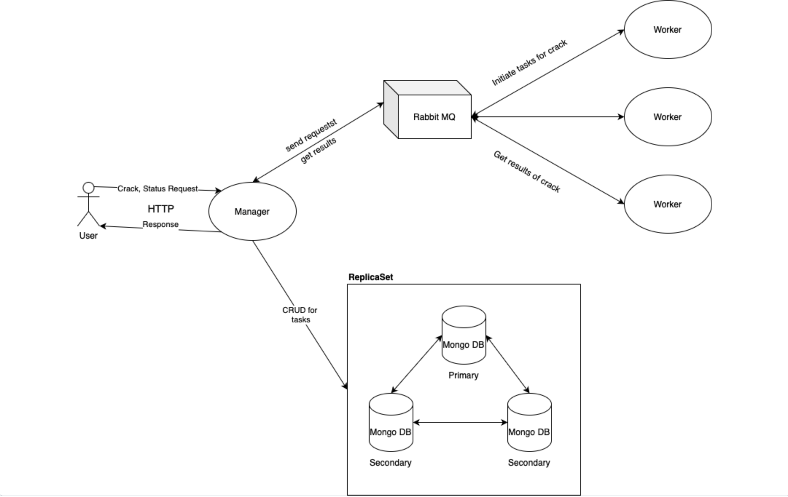

# CrackHash
Распределённая система для расшифровки хэша.

## Требования
- **Java 20**
- **Gradle** 
- **Docker**
- **Docker Compose**

## Схема работы


## Конфигурация
Настройки системы определяются в файле docker-compose.yaml, где конфигурация происходит через переменные окружения

## Запуск

Запустите систему с помощью Gradle:
   ```sh
   gradle crackHashStart
   ```

После успешного запуска менеджер будет доступен на `http://localhost:8080/api/crack`. Воркеры автоматически подключатся и начнут обработку задач.

Для прекращения работы введите:
```sh
gradle crackHashStop
```
